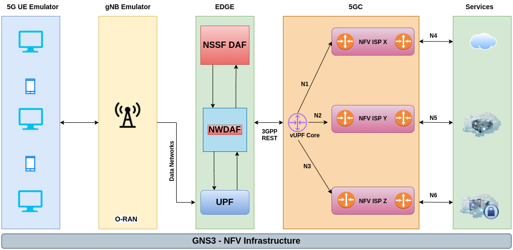

<!--  
 pandoc apresentacao.md -t beamer -o slide.pdf
  -->
---
title: "Seletor Fuzzy de Slice para Rede 5G"
subtitle: "Raciocínio Probabilístico em IA"
author: "Marco Antonio Firmino de Sousa"
institute: "Escola Politécnica da Universidade de São Paulo"
date: 23/06/2022
theme: "Copenhagen"
fonttheme: "professionalfonts"
aspectratio: 169
bibliography: references.bib
header-includes:
- \usepackage{pifont}
- \AtBeginSection[]{\begin{frame}\tableofcontents[currentsection]\end{frame}}
---

# Roteiro

---
fontsize: 12pt
---

\begin{itemize}
    \item[\ding{182}] Introdução
    \item[\ding{183}] Análise de Dados
    \item[\ding{184}] Lógica Nebulosa
    \item[\ding{185}] Conclusão
\end{itemize}

# Introdução

---
fontsize: 10pt
---

::: columns

:::: {.column width=35%}

Redes 5G

+ Ambiente Virtualizado
+ Compartilhamento de recursos
+ Orquestração
+ Demandas conflitantes
+ Network Slicing

::::

:::: {.column width=65%}

::::

::: 

# Introdução - Cenário de simulação

{width=80%}

# Análise de Dados - Dataset

---
fontsize: 8pt
---

## Dataset original - amostra

---
fontsize: 8pt
---

\scriptsize 

|Latency| Jitter |Loss|Protocol|Bandwidth |Transfer |UE |Test|Distance |Reliability|
|------:|-------:|---:|:-------|---------:|--------:|--:|---:|--------:|----------:|
| 0.791 |0.478568|  1 |TCP     |2005.33   |   71600 | 5 |  5 | 58.4645 |   99.9857 |
| 0.846 |0.475625|  0 |UDP     |6939.03   |  250000 | 3 |  1 | 70.8526 |   99.9923 |
| 0.877 |0.552609|  2 |TCP     |9008      |  322000 | 4 |  1 | 45.6483 |   99.9934 |
| 1.467 |0.104945| 14 |TCP     |  32.8357 |     543 | 5 |  6 | 54.3426 |   99.9942 |
| 1.406 |0.127431|  5 |TCP     | 264.194  |    9450 | 4 |  4 | 64.6599 |   99.9956 |

# Análise de Dados - Análise exploratória

{width=60%}

# Análise de Dados - Dataset 

## Dataset normalizado - amostra

---
fontsize: 8pt
---

| Latency| Jitter |   Loss |Bandwidth| Transfer|Distance|Reliability|
|-------:|-------:|-------:|--------:|--------:|-------:|----------:|
|0.422205|0.169569|0.032258|0.356844 |0.357136 |0.656077|  0.444722 |
|0.268882|0.237994|0.032258|0.285382 |0.285618 |0.456209|  0.511168 |
|0.640483|0.022175|0.129032|0.199628 |0.200115 |0.164611|  0.789599 |
|0.668429|0.005486|0.161290|0.000986 |0.001302 |0.202038|  0.784126 |
|0.379909|0.145783|0.032258|0.070997 |0.071462 |0.805840|  0.404022 |

# Análise de Dados - Dataset 

{width=65%}

# Análise de Dados - Agrupamento

{width=60%}

# Lógica Nebulosa - Caracterização do Slice 1

{width=70%}

# Lógica Nebulosa - Caracterização do Slice 2

{width=70%}

# Lógica Nebulosa - Caracterização do Slice 3

{width=70%}

# Lógica Nebulosa - Limites das variáveis

|    Atributo | Limite inferior    | Limite superior    | Valor médio        |
|------------:|-------------------:|-------------------:|-------------------:|
|     Latency | 0.5539999999999999 | 1.8780000000000001 | 1.0677720020586747 |
|      Jitter | 0.104944827586     | 2.14846710526      | 0.4147523657066549 |
|        Loss | 0                  | 31                 | 4.115285640761709  |
|   Bandwidth | 32.50769230769231  | 70000.0            | 18443.50519945193  |
|    Transfer | 139.0              | 2503000.0          | 658836.0941842512  |
|    Distance | 6.025443608093389  | 97.92975995607313  | 53.44939016741711  |
| Reliability | 99.98402061129444  | 99.99897206790564  | 99.9921602162676   |

# Lógica Nebulosa - Intervalos das variáveis linguísticas

::: columns

:::: column

{width=100%}

::::

:::: column

{width=100%}

::::

:::

# Lógica Nebulosa - Intervalos das variáveis linguísticas

::: columns

:::: column

{width=100%}

::::

:::: column

{width=100%}

::::

:::

# Lógica Nebulosa - Intervalos das variáveis linguísticas

::: columns

:::: column

{width=100%}

::::

:::: column

{width=100%}

::::

:::

# Lógica Nebulosa - Saída

{width=80%}

# Lógica Nebulosa - Conjunto de regras para capturar o tráfego para o Slice 1

\small 

+ R1: **SE** loss é baixa **E** latency é alta **ENTÃO** saída é slice 1
\scriptsize
+ R2: **SE** bandwidth é baixa **E** transfer é baixa **E** jitter é baixa **ENTÃO** saída é slice 1
\small
+ R3: **SE** distance é média **E** jitter é baixa **ENTÃO** saída é slice 1

+ R4: **SE** loss é alta **E** latency é alta **ENTÃO** saída é slice 1

# Lógica Nebulosa - Conjunto de regras para capturar o tráfego para o Slice 2

\small 

+ R5: **SE** bandwidth é alta **E** transfer é alta **ENTÃO** saída é slice 2

+ R6: **SE** jitter é baixa **E** transfer é alta **ENTÃO** saída é slice 2

+ R7: **SE** jitter é baixa **E** bandwidth é alta **ENTÃO** saída é slice 2

+ R8: **SE** latency é média **E** jitter é baixa **ENTÃO** saída é slice 2

# Lógica Nebulosa - Conjunto de regras para capturar o tráfego para o Slice 3

\small 

+ R9: **SE** loss é baixa **E** latency é baixa **ENTÃO** saída é slice 3

+ R10: **SE** bandwidth é baixa **E** loss é baixa **ENTÃO** saída é slice 3

+ R11: **SE** bandwidth é baixa **E** transfer é alta **ENTÃO** saída é slice 3

+ R12: **SE** jitter é média **E** loss é baixa **ENTÃO** saída é slice 3

# Lógica Nebulosa - Resultado de um processamento

::: columns

:::: column

::::

:::: column

| Atributos   | Valores           |
|:------------|:------------------|
| Latency     | 0.598             |
| Jitter      | 0.473480263158    |
| Loss        | 0                 |
| Bandwidth   | 15010.0           |
| Transfer    | 536000.0          |
| Distance    | 85.62687504501605 |

::::

:::

# Conclusão

::: columns

:::: column

- Pro
    + Potencial de uso e facilidade de interpretação
    + Evita o processo normalização
    + Robusto quanto a ruído

::::

:::: column
- Contra
    + Quantidade de regras
    + Avaliar se as regras são suficientes

::::

:::

# Referências

*Chagas da Silva, D., Bressan, G., Firmino de Sousa, M. A., and Silveira, R. M. 5G network slice selector in IoT services scenarios with QoS requirements guarantee. In 2022 IEEE Wireless communications and Networking Conference (WCNC) (IEEE WCNC 2022) (Austin, USA, Apr. 2022).*

*Iacovos Ioannou, Christophoros Christophorou, Vasos Vassiliou, Andreas Pitsillides. A novel Distributed AI framework with ML for D2D communication in 5G/6G networks. Computer Networks, Volume 211, 2022. ISSN 1389-1286*